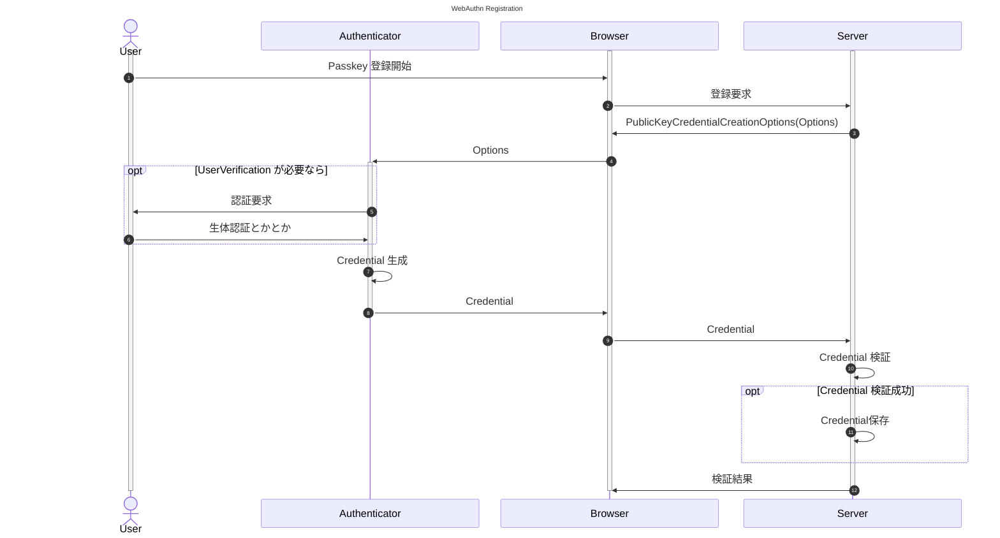
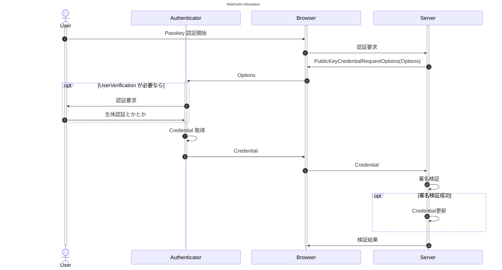

## registration

```mermaid
---
title: WebAuthn Registration
config:
  fontSize: 24
  sequence:
    width: 500
---
sequenceDiagram
  autonumber
  actor U as User
  participant A as Authenticator
  participant B as Browser
  participant S as Server
  activate U
  activate B
  activate S
  U->>B: Passkey 登録開始
  B->>S: 登録要求
  S->>B: PublicKeyCredentialCreationOptions(Options)
  B->>+A: Options
  opt UserVerification が必要なら
    A->>U: 認証要求
    U->>A: 生体認証とかとか
  end
  A->>A: Credential 生成
  A->>-B: Credential
  B->>S: Credential
  S->>S: Credential 検証
  opt Credential 検証成功
    S->>S: Credential保存
  end
  S->>B: 検証結果
  deactivate U
  deactivate B
  deactivate S
```

## Attestation

```mermaid
---
title: WebAuthn Attestation
config:
  fontSize: 24
  sequence:
    width: 500
---
sequenceDiagram
  autonumber
  actor U as User
  participant A as Authenticator
  participant B as Browser
  participant S as Server
  activate U
  activate B
  activate S
  U->>B: Passkey 認証開始
  B->>S: 認証要求
  S->>B: PublicKeyCredentialRequestOptions(Options)
  B->>+A: Options
  opt UserVerification が必要なら
    A->>U: 認証要求
    U->>A: 生体認証とかとか
  end
  A->>A: Credential 取得
  A->>-B: Credential
  B->>S: Credential
  S->>S: 署名検証
  opt 署名検証成功
    S->>S: Credential更新
  end
  S->>B: 検証結果
  deactivate U
  deactivate B
  deactivate S
```
